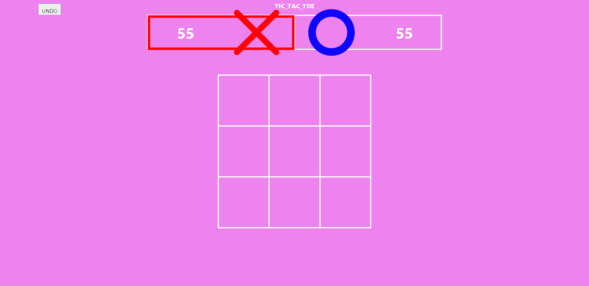
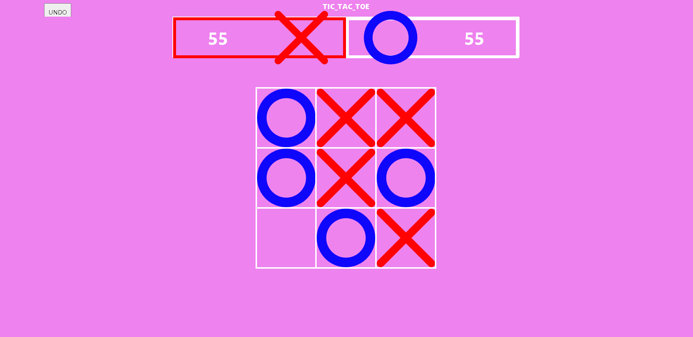

# TIC-TAC-TOE

Welcome to the Tic Tac Toe game! Tic Tac Toe, also known as "Noughts and Crosses" or "Xs and Os," is a classic two-player strategy game where players take turns marking X or O on a 3x3 grid. The objective of the game is to align three of your symbols in a row, either horizontally, vertically, or diagonally, before your opponent does.

In this project, we have implemented the Tic Tac Toe game using HTML, CSS, and JavaScript. The game is designed to be played on a web browser and features a simple user interface. The board is represented as a 3x3 grid, and each cell can be clicked to place either an X or an O, depending on the active player.

The interface includes a header displaying "TIC_TAC_TOE" and an "UNDO" button, which allows players to undo their last move if needed. The game keeps track of the players' moves and indicates whose turn it is during gameplay.

To play, simply click on an empty cell to place your symbol. The first player to align three of their symbols in a row wins the game. If all cells are filled without a winner, the game ends in a draw.

Feel free to enjoy this classic game with a friend or challenge yourself against the computer by taking turns and strategizing to claim victory.

Have fun playing Tic Tac Toe!

